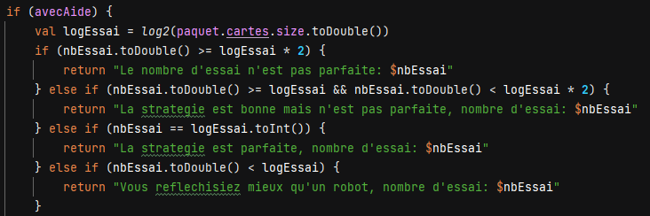
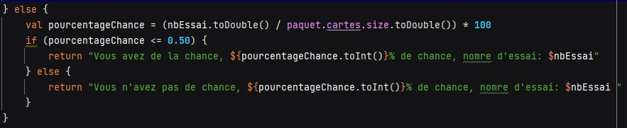

## Rapport du projet 0
Réalisé par TABAR LABONNE Baptiste et LAROUI Chakib

# Challenge 1

Nous avons commencé par vérier qu'un version ultérieur de git était instalé

Ensuite nous avons réaliser les test unitaires
Code : 

Résult : 

Code : 

Result : 

## Challenge 2
Pour commencer le challenge 2 nous devons réaliser le diagramme du jeu avec les changements

Diagramme : 

Dans le challenge 2 nous devons réalisé 5 TODO
Le premier Todo etait :
// TODO (A) demander au joueur s'il souhaite avoir de l'aide pour sa partie
Pour cela nous avons donc crée
une variable aide qui renvoie faux sauf si l'utilisteur répond oui a la question écrit par le développeur demandant a l'utilisateur si il souhaite de l'aide.

Code : 

}

Dans le second TODO
// TODO (A) demander au joueur avec quel jeu de cartes 32 ou 52 il souhaite jouer
nous demandons quel paquet le joueur souhaite utiliser. Une boucle a été créer tant que sa réponse ne correspond pas à 32 ou 52, la question est reposée

Code : 

La partie commence, nous demandons le nom, puis la couleur que le joueur souhaite tenter

Code : 

S’il y a une mauvaise définition des cartes (ou valeur nulle), on l’indique et on propose de réessayer  :

S’il n’y a pas d’erreur de définition, on regarde si la ”carteDuJoueur” correspond à la carte à deviner.

Code : 

Si le joueur a deviné la carte, un message s’affiche et le jeu s’arrête
Résultat :  

Dans le troisième TODO
// TODO: (A) si l'aide est activée, alors dire si la carte proposée est plus petite ou plus grande que la carte à deviner
Si l'utilisateur à activé l'aide avant la partie, l'utilisateur obtiendra un indice est on lui dira si la carte qu'il a choisi est inférieur, supérieur ou si il est pas de la bonne couleur.

Résultat :  
Dans le quatrième TODO
// TODO (A) permettre au joueur de retenter une autre carte (sans relancer le jeu) ou d'abandonner la partie
Nous demandons à l'utilisateur s'il souhaite retenter la partie et s'il répond oui alors l'utilisateur pourra recommencer gràce à une boucle.

Dans le dernier TODO
// TODO (A) Présenter à la fin la carte à deviner
Nous demandons à l'utilisateur s'il souhaite savoir la carte à deviner cependant la partie sera terminé.

Voici le diagramme final lorsque nous avons réalisé tout les TODO

# Challenge 4
Pour le challenge 4 la stratégie du joueur a dû être analysée.
Si le joueur a activé l'aide il pourra voir sa stratégie et son nombre d'essai
Code : 

S'il n'a pas activé l'aide, il verra son pourcentage de chance et son nombre d'essai

Code : 

Resultat : 

@startuml
start

:demander si activation aide assistance;
if(aide) equals (?) then
:oui;
else (?)
:non;
endif
while (demander quel jeu de cartes)
:erreur le paquet de cartes n'existe pas;
endwhile
:32 ou 52;
repeat :intialisation du jeu;
:demander nom de carte
demander couleur de carte;
if ( ?) equals (la carte à deviné a été trouvé) then
:fin de la partie;
stop
else (la carte à deviné n'a pas été trouvé)
if(aide) equals (oui) then
:informer si la carte à deviner est plus grande ou plus petite que la carte choisis ;
else (non)
endif
if(demander si vous souhaitez connaitre la carte) equals (oui) then
:on vous donne la carte à deviné;
:fin de la partie;
stop
else (non)
:demander si vous souhaitez abandonner;
endif
if(abandon) equals (oui) then
:fin de la partie;
stop
else (non)
:recommence;
endif
@enduml